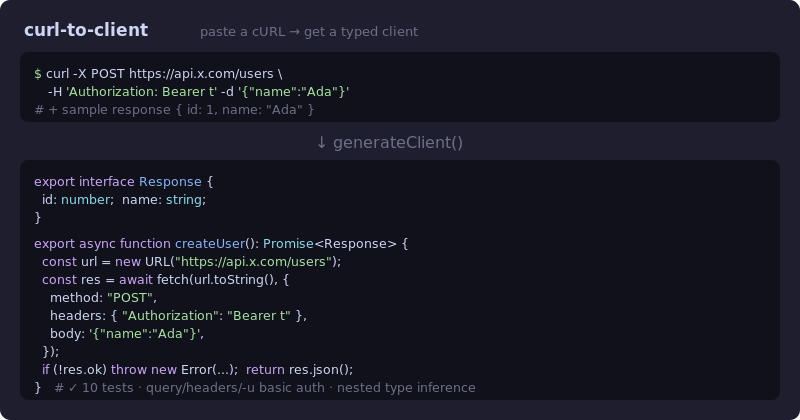

# curl-to-client

[](https://github.com/JCreatesGH/curl-to-client/actions)
[](https://www.typescriptlang.org/)
[](LICENSE)

Paste a `cURL` command, get a **typed TypeScript fetch client** — with the response type inferred from a sample JSON body. Turns the snippet from someone's API docs into real, typed code in one step.



## Install

```bash
npm install curl-to-client
```

## Use it

```ts
import { generateClient } from "curl-to-client";

const code = generateClient(
  `curl -X POST https://api.x.com/users -H 'Authorization: Bearer t' -d '{"name":"Ada"}'`,
  { functionName: "createUser", sampleResponse: { id: 1, name: "Ada" } }
);
```

produces:

```ts
export interface Response { id: number; name: string; }

export async function createUser(): Promise<Response> {
  const url = new URL("https://api.x.com/users");
  const res = await fetch(url.toString(), {
    method: "POST",
    headers: { "Authorization": "Bearer t" },
    body: '{"name":"Ada"}',
  });
  if (!res.ok) throw new Error(`${res.status} ${res.statusText}`);
  return res.json() as Promise<Response>;
}
```

## What it understands

- **cURL parsing** — `-X/--request`, `-H/--header`, `-d/--data(-raw|-binary)`, `-u` (basic auth → header), `-A`, query strings, quoted args, and `\`-line continuations. Method defaults to GET (or POST when a body is present).
- **Type inference** — nested objects become named `interface`s (deduped by shape), arrays infer their item type, non-identifier keys are quoted, root arrays become a `type` alias.
- **Composable** — `parseCurl`, `inferTypes`, and `tokenize` are exported individually.

## Development

```bash
npm install && npm test    # 10 tests
npm run build              # tsc, clean
```

## License

MIT
